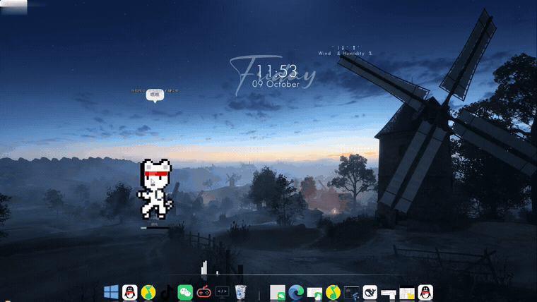
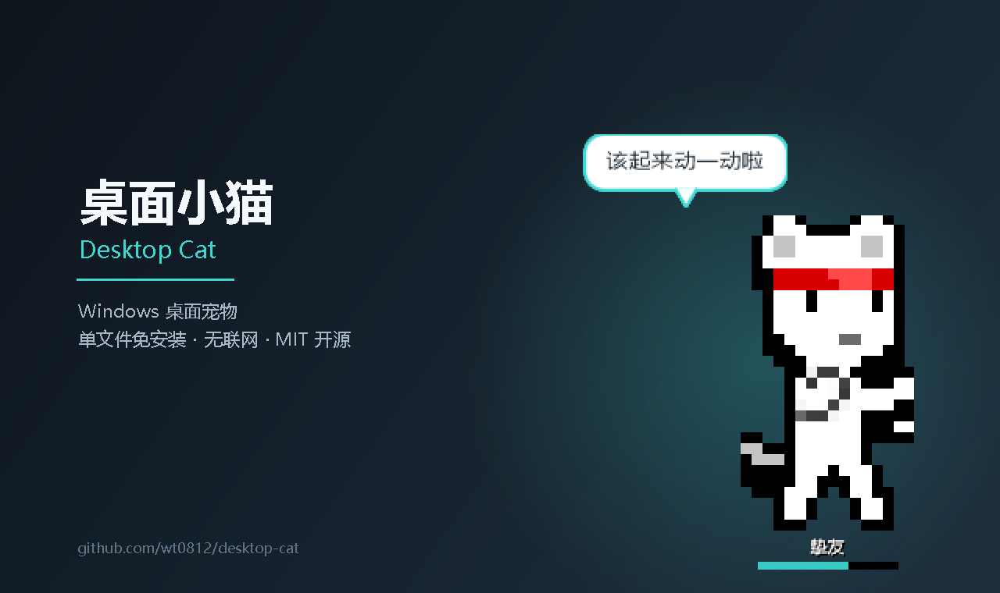
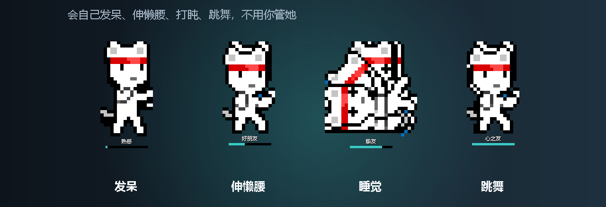
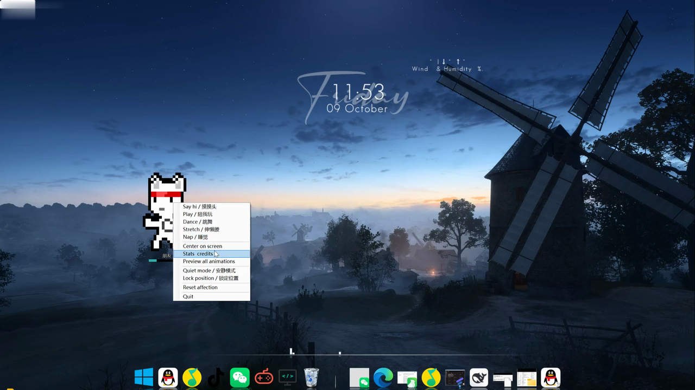

# Desktop Cat / 桌面小猫

**简体中文** | [English](README.en.md)

一只住在 Windows 桌面上的像素猫。她会自己发呆、伸懒腰、跳舞、撒欢，
偶尔提醒你该休息了。你摸她，她会理你，好感度会慢慢涨。

她记得自己待在哪、你摸过她多少次 —— 关掉再开，她还在原来的地方。

**程序作者：daijun** · **MIT 开源** · **Windows 10 / 11** · **免安装 · 无联网**

### ⬇ [下载 DesktopCat-1.1.zip](https://github.com/wt0812/desktop-cat/releases/latest)

> 国内下载（Gitee 发行版，通常更快）：https://gitee.com/wutong2005/desktop-cat/releases/latest

> 解压到任意一个你有写权限的文件夹，双击 `DesktopCat.exe` 就能用。
> 首次运行 Windows 会提示一次 SmartScreen（因为没买代码签名证书），
> 点「**更多信息**」→「**仍要运行**」即可 —— 详见[第五节的说明](#五关于那个安全提示请读一下)。

上面这张主图和下面的四条状态，都是程序自己的渲染代码画出来的，不是画的示意图

---

## 一、怎么运行

1. 把**整个文件夹**解压到一个**你有写权限的目录**里，例如「文档」或桌面。

   > ⚠ 不要放进 `C:\Program Files\`。那里只读，她会记不住自己的位置和好感度。

2. 双击 **`DesktopCat.exe`**。

3. 第一次运行，Windows 会弹出一个蓝色的「**Windows 已保护你的电脑**」。

   这是所有**没有买代码签名证书**的小工具的统一待遇，**不是**杀毒报警。
   点 **更多信息** → **仍要运行** 即可。

   想让它以后不再问：右键 `DesktopCat.exe` → **属性** → 最下面勾选
   **解除锁定** → 确定。然后重新运行一次。

---

## 二、怎么玩

她出现在屏幕上之后：

| 操作 | 结果 |
| --- | --- |
| **按住拖动** | 把她搬到别的地方，她会高兴一下 |
| **双击她** | 回到屏幕中央，并冒一个 `~♪` |
| **在屏幕上点一下** | 她有时会朝那个方向走过来 |
| **鼠标摸她的头 / 身体** | 好感度上涨；连着摸会触发欢呼；摸尾巴会掉 |
| **滚轮滚一下** | 好感度 ±10，并显示当前等级 |
| **右键点她** | 打开菜单（见下） |
| **托盘图标双击** | 相当于摸她一下 |
| **托盘图标右键** | 打开同一份菜单 |
| **Esc** | 退出，并保存位置和好感度 |

**找不到她了？** 右键托盘图标 → `Quit`，再重新启动一次。

### 菜单（右键点她，或右键托盘图标）

| 菜单项 | 作用 |
| --- | --- |
| `摸摸头` | 摸她一下，涨好感度 |
| `陪我玩` | 陪玩动画（最活跃的一个） |
| `跳舞` | 跳舞 |
| `伸懒腰` | 伸懒腰 |
| `撒欢` | 撒欢：四肢张开的转体扑腾（原来的「睡觉」这一格） |
| `Center on screen` | 把她挪回屏幕中央 |
| `Stats & credits` | 好感度、互动次数、素材署名 |
| `Preview all animations` | 把 12 个动画依次放一遍 |
| **`Quiet mode / 安静模式`** | 勾上后**一声不吭**：不弹气泡、不主动换动画，连休息提醒都不提。摸头、拖拽、菜单照常 |
| **`Lock position / 锁定位置`** | 勾上后**拖不动**，防止手滑把她拖走。摸头摸身照常 |
| `Reset affection` | 好感度清零 |
| `Quit` | 退出 |

两个开关都会被记住，下次开机还是你上次选的状态。

---

## 三、好感度等级

好感度封顶 400，一共 **6 级**（下表由程序自己报出，不是文档里手写的）：

| 等级 | 需要的互动值 | 名字 |
| --- | --- | --- |
| 1 | 0 | **陌生** |
| 2 | 20 | **熟悉** |
| 3 | 50 | **朋友** |
| 4 | 100 | **好朋友** |
| 5 | 200 | **挚友** |
| 6 | 400 | **心之友** |

摸头 +1（摸头顶 +2），滚轮 ±10。当前等级会显示在她脚下的那条细进度条上方。

---

## 四、你的数据在哪

全部放在程序目录下的 `.petdata\`：

| 文件 | 内容 |
| --- | --- |
| `config.json` | 位置、好感度、互动次数、安静模式与锁定位置 |
| `pet.log` | 运行日志（万一出问题，看这个） |
| `last-launch.txt` | 上一次启动的记录（启动器用来判断有没有起来） |

删掉整个 `.petdata\` 就等于恢复出厂设置。

**这个程序没有任何联网代码**：不联网、不上传、没有遥测、不写注册表、不需要管理员权限。

---

## 五、关于那个安全提示，请读一下

程序里装了**一个只读取鼠标位置的全局钩子**，用来判断你摸的是她的头还是身体。
它**不记录、不保存、不发送**任何东西 —— 但这也是某些杀毒软件会对它敏感的原因。

因为**没有买代码签名证书**，Windows 会在第一次运行时提示一次。这不是病毒警报。

---

## 六、系统要求

| 项 | 要求 |
| --- | --- |
| 系统 | **Windows 10 / 11** |
| 运行库 | **不需要额外安装** —— 用系统自带的 PowerShell 5.1 与 .NET Framework 即可 |
| 联网 | **完全不需要**（断网也能跑） |
| 管理员权限 | **不需要** |
| 写权限 | **需要** —— 她要往程序目录下的 `.petdata\` 写自己的记忆 |

---

## 七、常见问题

**Q：下载或双击时 Windows 报「不常见的应用」，是不是有毒？**
不是。原因就是**没买代码签名证书**，所有未签名软件都这样。Release 页里有 zip 的
SHA256 可以校验；完全不想跑 exe 的话，也可以直接用 PowerShell 运行源码 `pet.ps1`。

**Q：它联网吗？会不会上传东西？**
不联网。源码里搜不到 `HttpClient`、`WebClient`、`WebRequest`、`Socket` 中任何一个。
你可以把网断掉再启动，它照样活。

**Q：那个鼠标钩子是在监视我吗？**
它只判断一件事：**左键按下了**（用来实现摸头）。不记录坐标、不保存、不发送，
判断完立刻把事件还给系统；**右键完全没有挂钩**。

**Q：怎么彻底卸载？**
删掉整个程序文件夹就行 —— 数据全在里面的 `.petdata\`。不写注册表、不碰 `%APPDATA%`、
不装服务、不留开机项。

**Q：怎么让它开机自动启动？**
目前**软件里还没有这个开关**（在计划里）。临时办法：`Win+R` 输入 `shell:startup`，
把 `DesktopCat.exe` 的快捷方式丢进去。

**Q：我想改它 / 二次开发。**
欢迎。源码就是根目录那个 `pet.ps1`（单文件、纯 PowerShell + 内嵌 C#），
改完用 `tools\build-exe.ps1` 重新打包。细节见 [DEVELOPMENT.md](DEVELOPMENT.md)。

**Q：有 Mac / Linux 版吗？**
没有，也不会很快有 —— 现在是纯 Windows 实现（WinForms + Win32 鼠标钩子 + 透明窗口），
换平台基本等于重写。

**Q：发现问题怎么办？**
直接在本仓库开一个 [Issue](https://github.com/wt0812/desktop-cat/issues)，
把 `pet.log` 最后几十行贴上来，基本一眼能定位。

---

## 八、许可

**程序代码**：**MIT 许可证**，全文见随包的 [LICENSE](LICENSE)。

你可以自由使用、修改、再分发，**甚至可以商用** —— 唯一的义务是保留版权声明。

**角色美术素材**不适用 MIT，它是 **[CC-BY 3.0](https://creativecommons.org/licenses/by/3.0/)**：

角色像素画来自 **[Cat Fighter Sprite Sheet](https://opengameart.org/content/cat-fighter-sprite-sheet)**，
作者 **dogchicken**。

按 CC-BY 3.0 的要求，**再分发时请保留随包的 [CREDITS.txt](CREDITS.txt)** ——
里面有完整署名，以及 12 个动画各自的用途说明。

---

## 九、更多文档

| 文件 | 里面有什么 |
| --- | --- |
| [DEVELOPMENT.md](DEVELOPMENT.md) | 架构、目录结构、构建与打包流程、怎么调她的行为 |
| [RELEASE-NOTES-v1.0.md](RELEASE-NOTES-v1.0.md) | 这个版本改了什么、两个 sha256 校验值 |
| [CHANGELOG.md](CHANGELOG.md) | 逐条功能迭代（Keep a Changelog 格式） |
| [RELEASE-NOTES-v1.1.md](RELEASE-NOTES-v1.1.md) | v1.1 改了什么、两个 sha256 校验值、实测系统占用 |
| [DECISIONS.md](DECISIONS.md) | **36 条技术决策记录**：为什么用 WinForms 不用 Electron、为什么透明窗口要设 `TransparencyKey`、为什么鼠标钩子不挂右键……踩过的坑都在里面 |
| [CREDITS.txt](CREDITS.txt) | 美术素材的完整署名（CC-BY 3.0 要求） |
| [tools/](tools) | 开发用脚本：打包 exe、离屏截状态图、部署、探测等 |
